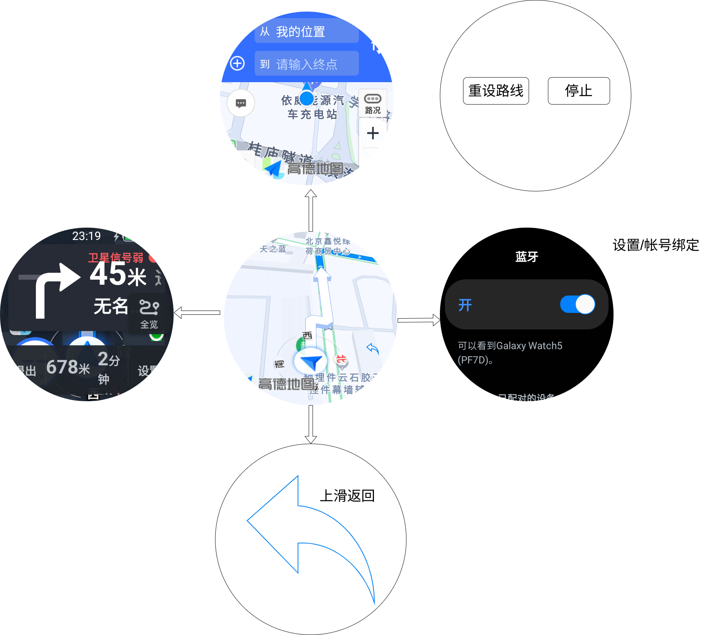

# DragonRadar

基于高德地图的WearOS导航App.

> **说明**：出于安全与版权保护考虑，本仓库仅开源了早期版本。新版本在 UI 交互设计与服务体验上进行了核心优化，目前尚未公开。公开的早期版本源码请参考 [`main` 分支](https://github.com/qtopie/DragonRadar/tree/main)。

## 源码

公开的早期版本源码位于 [`main` 分支](https://github.com/qtopie/DragonRadar/tree/main)。

## 设计

## 功能

- [x] 基础定位功能
- [x] 骑行路线导航
- [ ] 个人帐号,可以存储常用地点和设置
- [ ] 手机端推送起始地点和目的地,直接开始导航

