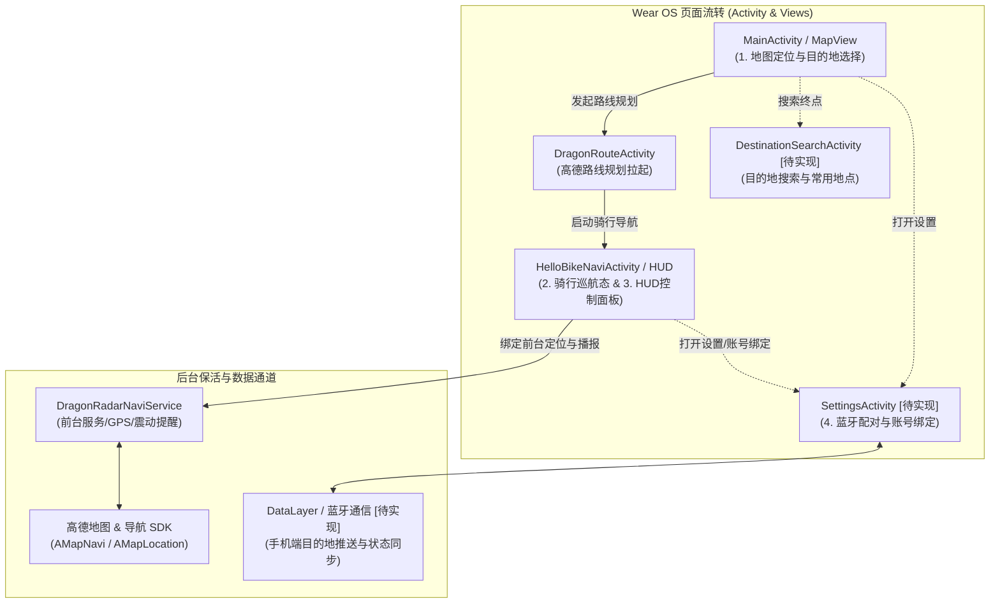

# DragonRadar 系统与交互架构设计 (System & Interaction Design)

基于高德地图 SDK 的 Wear OS 独立/协同骑行导航系统。

---

## 1. 总体架构与交互流转 (High-Level Interaction Architecture)

---

## 2. 核心页面设计与 Activity 状态矩阵 (Activity Implementation Status)

对照 `docs/dragon-radar-design.png` 设计图：

| 交互界面序号 | 界面名称与职责 | 对应 Activity / 类 | 状态 | 待完成工作 / 规划 |
| :--- | :--- | :--- | :---: | :--- |
| **页面 1** | **地图定位与目的地设定** - 起点（我的位置）与终点输入 - 路况切换、地图缩放(+/-)、收藏入口 | `MainActivity.kt` `DragonRouteActivity.kt` | ⚠️ 部分实现 | 补充自定义选点/输入框，接入常用地点快捷选择与手机推送接收。 |
| **页面 2 & 3** | **骑行导航与 HUD 指引控制** - 3D 轨迹巡航、电子罗盘 - HUD 转向卡片、剩余距离/预计用时、车速 - 底部控制面板（停止、重设路线、全览、设置） | `HelloBikeNaviActivity.kt` `BaseNaviActivity.kt` `DragonRadarNaviService.kt` | ⚠️ 骨架就绪 | 解除回调注释，联调转向与测距数据刷新，实现“停止/重设路线/全览”手势与按钮响应。 |
| **页面 4** | **设置 / 账号绑定 / 蓝牙配对** - 蓝牙配对开关与设备扫描 - 手机端账号绑定与数据同步 - 上滑返回手势 | `SettingsActivity.kt` / `DeviceBindActivity.kt` | ❌ 待实现 | 新建独立 Activity，集成 Wearable Data Layer / Bluetooth 状态管理及上滑返回组件。 |
| **辅助页面** | **目的地搜索 / 常用地点选择** - 关键字搜索 POI - 家/公司等常用地点快捷列表 | `DestinationSearchActivity.kt` | ❌ 待实现 | 新建搜索 Activity，对接高德搜索 SDK（AMapSearch）及本地常用地点存储。 |

---

## 3. 后台服务与传感器交互 (Background & Telemetry Flow)

1. **DragonRadarNaviService**：作为 Foreground Service，持有 Notification 与 WakeLock，持续监听定位变化及导航转向事件。
2. **触觉反馈 (Haptic Feedback)**：通过 `NaviInfoCallback` 驱动 `VibratorManager`，在接近转弯路口时发出震动脉冲提醒。
3. **低功耗与屏幕常亮**：巡航模式下适度保持屏幕亮起，并在 Wear OS 环境下优化电池开销。
